# Architecture Documentation

This document provides detailed architecture diagrams for the Azure Analysis Services MCP Agent solution.

---

## 1. High-Level System Architecture

---

## 2. Authentication Flow (Managed Identity)

---

## 3. Request/Response Data Flow

---

## 4. Component Interaction (Sequence Diagram)

---

## 5. Deployment Architecture

```mermaid
graph TB
    subgraph "Azure Subscription"
        subgraph "Resource Group"
            Storage[Storage Account<br/>Azure Files]
            
            subgraph "Function App"
                Runtime[.NET 8 Runtime<br/>Isolated Worker]
                Code[Function Code<br/>QueryAasFunction.cs]
                Settings[App Settings<br/>Environment Variables]
            end
            
            Identity[Managed Identity<br/>System-assigned]
        end
        
        AAS[Azure Analysis Services<br/>Tabular Model]
        AAD[Azure Active Directory<br/>Token Provider]
        Monitor[Application Insights<br/>Logging & Monitoring]
    end
    
    Developer[👨‍�💻 Developer]
    Client[💻 Client Machine<br/>MCP Server + Agent]
    
    Developer -->|Deploy via<br/>func CLI| Code
    Code --> Runtime
    Runtime --> Settings
    Runtime --> Identity
    
    Settings -.->|Read config| Runtime
    Identity -->|Request token| AAD
    AAD -->|OAuth token| Identity
    
    Client -->|HTTPS| Runtime
    Runtime -->|ADOMD.NET<br/>+ Token| AAS
    
    Runtime -->|Telemetry| Monitor
    Code -->|Store artifacts| Storage
    
    style Storage fill:#e1f5ff,color:#000
    style Runtime fill:#ffe1e1,color:#000
    style Code fill:#fff4e1,color:#000
    style Identity fill:#e1ffe1,color:#000
    style AAS fill:#e1e1ff,color:#000
    style AAD fill:#ffe1f5,color:#000
```

---

## 6. Protocol Stack

---

## 7. Why This Architecture?

```mermaid
graph TD
    Problem[Problem: Query Azure<br/>Analysis Services<br/>from AI Agent]
    
    Challenge1[Challenge 1:<br/>AAS requires ADOMD.NET]
    Challenge2[Challenge 2:<br/>Python has no ADOMD library]
    Challenge3[Challenge 3:<br/>XMLA over HTTP not supported]
    
    Solution1[✅ Solution:<br/>C# Azure Function<br/>with ADOMD.NET]
    
    Solution2[✅ Solution:<br/>Python MCP Server<br/>calls HTTP endpoint]
    
    Benefit1[Benefit:<br/>Secure OAuth<br/>authentication]
    Benefit2[Benefit:<br/>Managed Identity<br/>no secrets!]
    Benefit3[Benefit:<br/>Serverless<br/>auto-scaling]
    
    Problem --> Challenge1
    Problem --> Challenge2
    Problem --> Challenge3
    
    Challenge1 --> Solution1
    Challenge2 --> Solution2
    Challenge3 --> Solution1
    
    Solution1 --> Benefit1
    Solution1 --> Benefit2
    Solution1 --> Benefit3
    
    style Problem fill:#ffe1e1,color:#000
    style Challenge1 fill:#fff4e1,color:#000
    style Challenge2 fill:#fff4e1,color:#000
    style Challenge3 fill:#fff4e1,color:#000
    style Solution1 fill:#e1ffe1,color:#000
    style Solution2 fill:#e1ffe1,color:#000
    style Benefit1 fill:#e1f5ff,color:#000
    style Benefit2 fill:#e1f5ff,color:#000
    style Benefit3 fill:#e1f5ff,color:#000
```

---

## 8. Security Architecture

---

## Key Design Decisions

### 1. **Hybrid Language Architecture**
- **C# for Azure Function**: Only language with ADOMD.NET support for AAS
- **Python for MCP/Agent**: Better for AI/ML ecosystem and MCP protocol

### 2. **Managed Identity (Recommended)**
- ✅ No secrets to manage or rotate
- ✅ Automatic token refresh
- ✅ Least-privilege access
- ✅ Azure AD integration

### 3. **Serverless with Azure Functions**
- ✅ Pay-per-execution pricing
- ✅ Auto-scaling based on load
- ✅ Built-in monitoring
- ✅ No infrastructure management

### 4. **MCP Protocol for AI Integration**
- ✅ Standard protocol for AI tools
- ✅ Language-agnostic
- ✅ Easy to integrate with various AI frameworks
- ✅ Clean separation of concerns

---

## Environment Variables Flow

**Note:** MCP Server only needs Azure Function URL - it doesn't need AAS credentials!

---

## Troubleshooting Flow

---

## Future Enhancements

---

## How to View These Diagrams

### In GitHub
All diagrams render automatically when you view this file on GitHub.

### In VS Code
1. Install "Markdown Preview Mermaid Support" extension
2. Open this file and press `Ctrl+Shift+V` (or `Cmd+Shift+V` on macOS)

### Export to PNG/SVG
1. Visit [Mermaid Live Editor](https://mermaid.live/)
2. Copy any diagram code
3. Export as PNG or SVG

### In Documentation Sites
Most static site generators (Hugo, Jekyll, Docusaurus) support Mermaid natively.
